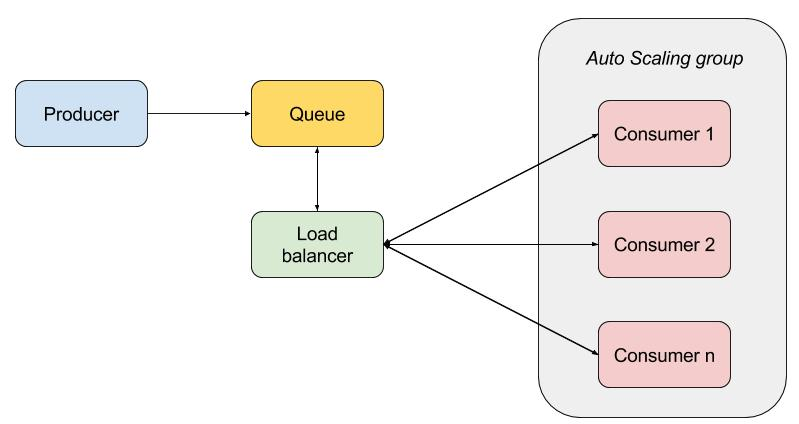
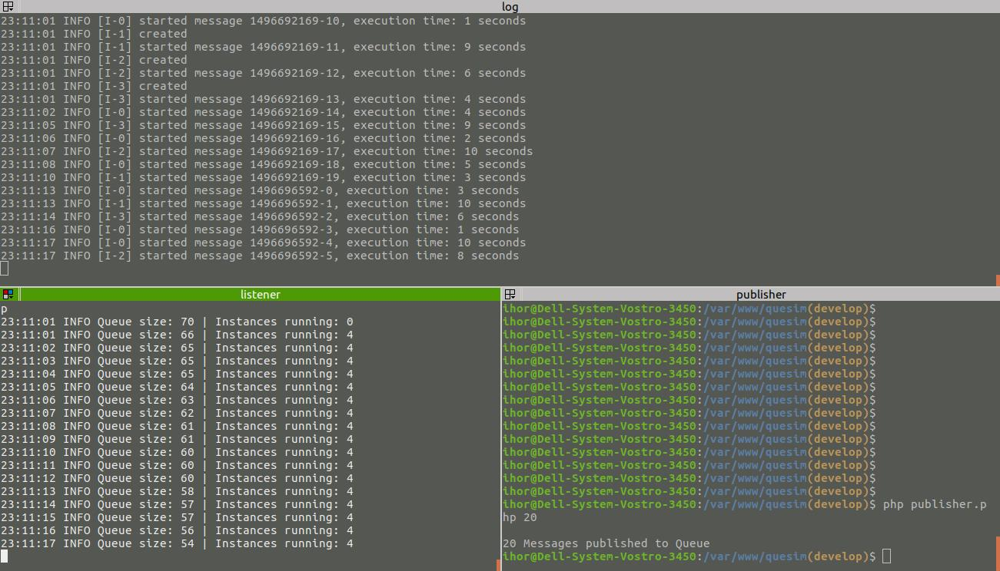

###Remark
This is simple not-distributed solution. It's quite abstract, but I hope it's displaying requested in task infrastructure. I tried to make simulation as clearly as possible remembering restrictions about forking and multi-threading of processes.
I skipped not necessary part of the task, but consider that current solution not requiring many changes to implement it.

If desired solution should be distributed with separate docker containers created dynamically, it also can be done, in one week.

Unfortunately, during this weekend I had no chance to check simulation running on other machines, so if there are any troubles with checking it, don't hesitate to contact me.

## Solutuion Description
In due to simulate a system of a producer and a group of auto-scaled consumers connected by a queue I decided to follow next simple markup:


To simulate desired system I choose not distributed solution with two entry points: publisher.php and listener.php which can run in parallel and are conected by Queue, stored in csv file.

### System Representation

#### Producer
Service which simulates Producer server. Responsibility - add messages to Queue.

#### LoadBalancer
Service which simulates LoadBalancer server. Responsibility - send messages to free Consumers in Auto Scaling Group of instances.

#### Queue
Storage of messages for Producer and LoadBalancer which simulates Message Broker for the system. It is saved into var/queue.csv file. 
Queue has limited size, that is set in app/config.ini. If size is exceeded, system loosing old messages.

#### Auto Scaling Group
Collection of Consumer instances, responsible for creation of new necessary instances and destroying unnecessary instances. Maximum number of instances is limited anc can be set in app/config.ini

#### Consumer
Entity for simulation of instance proceeding messages. Parallel instance simulation was done by setting the "instance will be busy till" date for instance proceeding message. One instance can proceed only one message in time.

### System Entry Points

#### publisher.php $number_of_messages_to_add
Script for simulation of publishing messages to Queue via Producer. Can be run anytime independent of listener.php.

#### listener.php 
Script for simulation of work Server with LoadBalancer. It runs continuously, checking if we have new messages in Queue and transfering them to LoadBalancer

### What is missed
* integration test to cover services and repository
* support of multiple queues (can be done by modification only in publisher.php and listener.php)

## Running Simulation

### Technical requirements
* CLI php 7.0 
* composer
* xdebug
* php-mbstring

### Installation

```sh 
git clone $url $your_folder
``` 
```sh 
cd $your_folder
```
```sh 
git checkout develop
```
```sh 
composer install
```
### Configuration

Configuration is saved in app/config.ini. Important settings are:

* queue_max_size - limiting number of messages saved in Queue. System removing old messages if this number is exceeded
* scaled_group_max_size - maximum number of instances which can be created for proceeding of messages in the same time

### Basic Usage


* Run Listener to proceed queue
```sh 
php listener.php
```
* In separate terminal run publisher to send messages to Queue, argument - amount of message
```sh
php publisher.php 20
```
* Check detail logs by consumers
```sh
tail -f var/consumer.log 
```
* You can run publisher anytime, listener will pick up new messages for execution by LoadBalancer

### Automated tests
* run via
```sh
/vendor/bin/phpunit
```
* check report in tests/reports/coverage/index.html